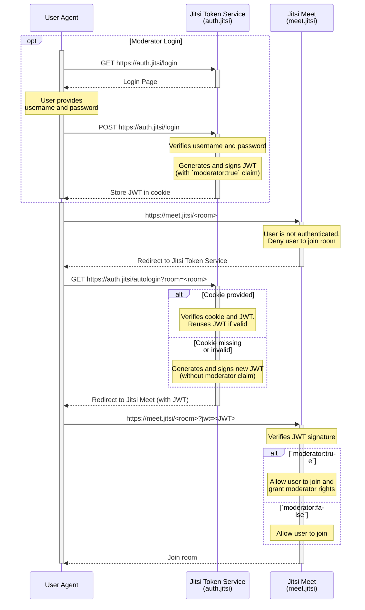

# jitsi-token-service

This project provides an implementation of a token provider for the
[Jitsi JWT authentication mechanism](https://github.com/jitsi/lib-jitsi-meet/blob/f5f1c314c9de875357b41784254aa73768d2bfdc/doc/tokens.md)
for _self-hosted_ Jitsi Meet installations.
In particular, it also is able to generate moderator tokens for the
[`token_affiliation`](https://github.com/jitsi-contrib/prosody-plugins/blob/127ef7e89d6d36e1a1c95897c857f86a7f485a4a/token_affiliation/README.md)
plugin.

This effectively allows you to provide an external login system for authenticating
Jitsi moderators (without the need)

## Configuration

### Environment

This section describes the environment variables which are used to configure
the token service:

- `COOKIE_NAME` _(required)_: Name of the moderator cookie (example: `jitsi_mod_jwt`)
- `JWT_VALIDITY` _(default: `1h`)_: Duration for which the generated token
  should be valid for (example: `1h30m`, `300s`)
- `JWT_APP_SECRET` _(required)_: Secret JWT signing string, this value needs
  to match the one configured in Jitsi meet (example: `my_jitsi_app_secret`)
- `JWT_APP_ID` _(required)_: JWT issuer, this value needs
  to match the one configured in Jitsi meet (example: `my_jitsi_app_id`)
- `JWT_AUDIENCE` _(default: `jitsi`)_: JWT audience, this value needs
  to match the one configured in Jitsi
- `JWT_LEEWAY` _(default: `1m`)_: Maximum clock drift allowed for JWT validation
- `PUBLIC_URL` _(required)_: Jitsi Meet base URL (without the room identifier)
  (example: `https://meet.jitsi`)
- `HTML_DOCROOT` _(default: `./html`)_: Directory containing the HTML login
  form template
- `HTML_TITLE` _(default: `Jitsi Moderator Login`)_: HTML title displayed to
  the user on the login form
- `MODS_FILE` _(default: `./mods.htpasswd`)_: Path to the htaccess file containing
  the list of all authorized moderators with their password hash
- `HTTP_ADDR` _(default: `:8080`)_: Address on which the HTTP server will listen on

### Moderators File

The `MODS_FILE` environment variable must point to a text file in the `htaccess`
format containing all authorized moderators with their accompanying password
hashes. Use one line per username and pasword pair. Empty lines or comment lines
(starting with `#`) are allowed.

The password hash needs to be a [bcrypt](https://en.wikipedia.org/wiki/Bcrypt)
hash (cost 11 or higher is recommended).

```apache
# example mods.htaccess file:
bob:$2y$12$EAZVfUzqmzqloNbfRAqY.e295IjhfHI/Ma2Tezqk8DryRZnkOT792
alice:$2y$12$ianjnXNNHVQwiy3R15NsiO.lC04uEG7SEzP6qv/Rs1NZmNyPB6Muu
```

> [!NOTE]
> The moderator file username is only used for authentication and is not
> forwarded to Jitsi Meet in any form.
> Moderators may use a different username as their "Display Name" when joining
> a Jitsi Meet room.

### Jitsi

For details on how to configure your self-hosted instance of Jitsi,
please refer to the Jitsi documentation.
The following example illustrates what values may be relevant when using
[jitsi/docker-jitsi-meet](https://github.com/jitsi/docker-jitsi-meet):

```shell
# Enable JWT authentication
ENABLE_AUTH=1
AUTH_TYPE=jwt

# JWT identifier and secret (shared between Jitsi and the token service)
JWT_APP_ID=my_jitsi_app_id
JWT_APP_SECRET=my_jitsi_app_secret # important: change this!

# URL to this token service
TOKEN_AUTH_URL=https://auth.jitsi:8080/autologin?room={room}

# Enable the token_affiliation Prosody plugin
XMPP_MUC_MODULES=token_affiliation
```

## Login Flow


